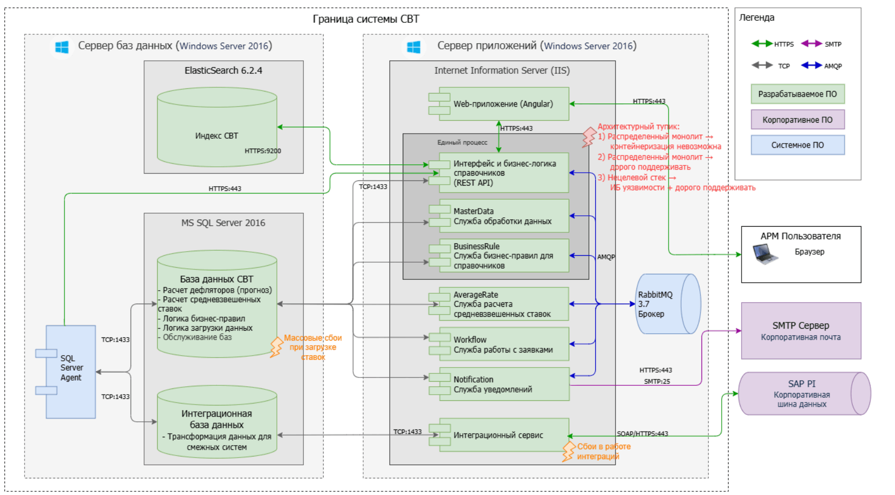
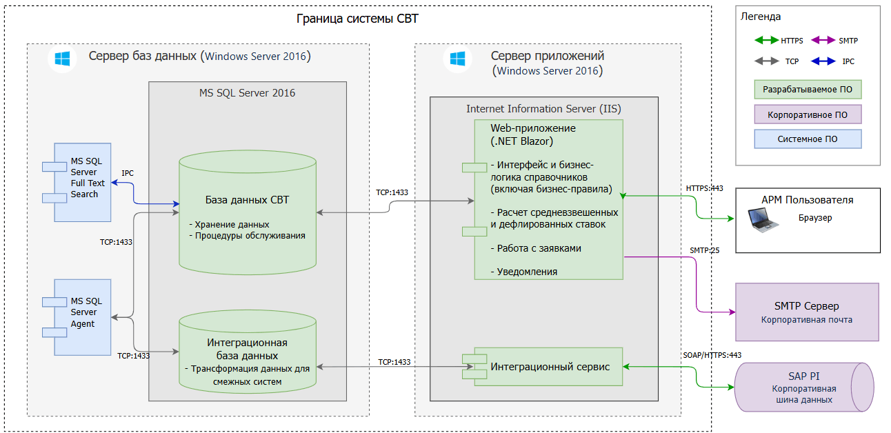
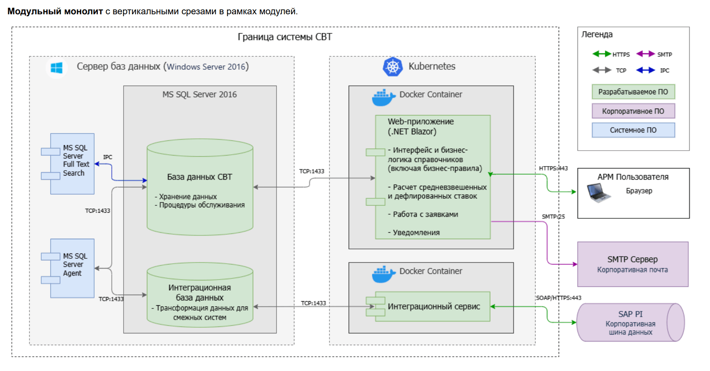

# Архитектура СВТ: проблемы и решение

> Источник: «Архитектура_СВТ_проблемы_и_решение_v19», 23.06.2026 (сравнительные таблицы альтернатив
> §5 и диаграммы §2/§4.2 — из полной версии документа с более детальным обоснованием).

## 1. Бизнес-ценность

**Система Ведения Тарифов (СВТ)** — MDM по управлению логистическими маршрутами, тарифами, складскими ограничениями.

Изначально проектировалась под справочники; со временем «обросла» логикой расчётов и интеграций.

### Масштаб

| Параметр | Значение |
|----------|----------|
| Справочники | ~100 реляционных |
| Поля | 10–100 на справочник |
| Записи | 20 – 2 000 000 (цель новой: до 10 млн) |
| Пакетная загрузка | 10 – 30 000 строк |
| Пользователи (чтение) | 300 |
| Пользователи (запись) | 10 |
| Интеграционные потоки | 30 (18 исходящих, 16 входящих) |

### Конкретные инциденты (иллюстрация проблематики, для §3)

- 2025 г.: массовые сбои СВТ при загрузке ставок в БД (пиковая нагрузка на бизнес-процесс).
- Точечная доработка: добавить одно поле в отчёт — 2 человеко-дня, либо технически невозможно
  в рамках текущей метамодели.
- Рост стоимости владения: штат 3-й линии поддержки вырос до 1,5 FTE на сопровождение технического
  долга (без роста функциональности для бизнеса).
- При сохранении текущей архитектуры в перспективе 1–2 лет — риск технического дефолта системы:
  остановка СВТ парализует расчёт стоимости логистики и оставляет ~8 смежных систем без актуальных
  тарифов и маршрутов.

## 2. Легаси-стек (As-Is)

- Front End: Angular
- Back End: .NET (C#)
- БД: MS SQL
- Кеш: Elastic Search
- Брокер: RabbitMQ
- Хостинг: ВМ + IIS

Формально — микросервисы, фактически — **распределённый монолит**: общая БД, сервисы как .NET-сборки, смешанное взаимодействие (RabbitMQ / БД / прямые вызовы).

### Диаграмма развёртывания (As-Is)



Общая БД (MS SQL + Elastic-индекс), единый процесс IIS с пятью условно-независимыми службами
(REST API / MasterData / BusinessRule / AverageRate / Workflow / Notification), связанными частично
через RabbitMQ, частично напрямую, частично через БД, частично включением библиотек одних сервисов в другие — визуальное подтверждение «распределённого
монолита» из §3. Отмеченные на схеме точки отказа (массовые сбои при загрузке ставок, сбои
интеграций) соответствуют строкам таблицы §3 «Проблематика».

## 3. Проблематика (As-Is)

| Проблема | Техническая причина | Последствие |
|----------|---------------------|-------------|
| Архитектурная деградация | Распределённый монолит | Любое изменение затрагивает несколько контуров |
| БД как вычислительный движок | Оркестрация, валидация, расчёты, интеграции в БД | 2M — деградация, 3M — отказ, 30K импорт — сбои |
| Несогласованность данных | Elastic рассинхронизируется с БД | Устаревшие/некорректные данные |
| Метамодель не подходит | Справочники через мета-описание | Нет constraints, инвариантов домена |
| Бизнес-логика размазана | C# + SP + SQL Server Agent | Дорого менять, сложно тестировать |
| Дублирование правил | Отдельно для batch и UI | 2× трудоёмкость, расхождение поведения |
| Низкая наблюдаемость | Нет аудита/трассировки | Долгое расследование инцидентов |

### Пределы легаси

- До 1 млн записей — рабочая зона
- 2 млн — деградация
- 3 млн — отказ
- 30 тыс. строк сложного импорта — сбои

## 4. Целевое решение

> Глоссарий узких терминов (SoT, write-through, dual-run, watermark, CQRS и др.) — в roadmap.md §1.2а.


### 4.1 Стратегия замещения

**Strangler Fig** — эволюционное замещение с сохранением общей БД на переходный период. Старая и новая системы работают параллельно. Не Big Bang.

Преимущества: низкий риск для бизнеса, поэтапная поставка ценности, параллельная сверка расчётов, простой откат отдельных сценариев.

### 4.2 Целевая архитектура

**Модульный монолит** с вертикальными срезами в рамках модулей.

#### Диаграмма развёртывания — целевая архитектура текущей программы (итог MVP 2.0 / Gate D)



Та же ВМ и тот же Windows Server 2016/IIS, что и в легаси (см. roadmap.md §1.3 — «дочернее
приложение в том же IIS-сайте»), — инфраструктура сознательно не меняется ради бесшовности
перехода. Меняется состав ПО: пять легаси-служб схлопнуты в один процесс `.NET Blazor`
(модульный монолит), Elastic и RabbitMQ выведены из контура, поиск — через
`MS SQL Server Full Text Search`. Эта диаграмма отражает состояние **после** Gate D (легаси
полностью демонтирован, см. roadmap.md раздел 19) — состояние во время dual-run (легаси-UI и
новый UI одновременно в одном IIS-сайте, переключаемые через URL Rewrite) отдельно не
диаграммировано и описано текстом в roadmap.md §1.3.

**Аппаратная конфигурация** (сервер приложений / сервер БД — отдельные ВМ, см. диаграмму): 8 ядер /
32 ГБ под IIS/Blazor Server; 4 ядра / 32 ГБ  под MS SQL Server. Предварительные факты нагрузочного тестирования
на этой конфигурации (100 конкурентных Blazor-сессий, массовое изменение 200К записей в легаси) —
roadmap.md §6.9.

> **Осознанное исключение из принципа «бизнес-логика в C#, не в SP»:** блок «Интеграционная
> база данных — трансформация данных для смежных систем» на диаграмме сознательно оставлен на
> стороне БД. Согласно roadmap.md разделу 18, при выносе оркестрации из SQL Server Agent сама
> SP-логика трансформации `mdm_integ ↔ mdm` не переписывается («внешние адаптеры не переписываем»,
> «минимальные точечные правки легаси только там, где без них нельзя подключить оркестрацию») —
> риск и стоимость переписывания низкоприоритетного интеграционного слоя (MVP 1.2) признаны выше
> пользы от полного соответствия принципу для этого конкретного, некритичного участка.

#### Возможное будущее состояние (вне скоупа текущей программы)



Контейнеризация (Docker/Kubernetes) **не входит** в текущую программу трансформации
(MVP 0.0–2.0) и нигде не фигурирует в бэклоге roadmap.md. Показана здесь как возможный
самостоятельный шаг **после** завершения текущей программы, с отдельным бизнес-кейсом (ROI,
эксплуатационная модель, компетенции DevOps) — не как часть согласуемого сейчас плана. Единственное,
на что этот сценарий уже сейчас влияет: текущий выбор привязка сессии к узлу (session affinity) для Blazor Server (см. §6.1)
не должен архитектурно исключать последующий переход на многоузловой/K8s-деплой.

### 4.3 Целевой стек

| Компонент | Решение |
|-----------|---------|
| UI + Backend | .NET Blazor Server |
| БД | MS SQL — единственное хранилище и поиск (FTS); на переходный период SoT = легаси-таблицы |
| Поиск | SQL Full-Text + индексы (без Elastic) |
| Очереди | Нет RabbitMQ на переходный/целевой период |
| Логика | Прикладной код C# (не в БД) |
| Модель данных | Типизированная (таблица на справочник) |
| Нагрузка | CQRS (разделение read/write) |
| Массовая загрузка | Единый механизм для импорта и ручного ввода |

### 4.4 Ожидаемый эффект

- Меньше связность → быстрее доработки
- Unit-тесты бизнес-логики → ниже регрессии
- До 10 млн записей, пакеты до 30K строк
- Вычисления на приложении → масштабируемая обработка
- Один контур хранения без Elastic → нет рассинхронизации кеша с БД
- На переходный период SoT = легаси-таблицы (сквозная запись (write-through) из нового UI); Смена источника истины (SoT flip) — инкрементальная, по доменам справочников, после чего write-through продолжается до финального демонтажа легаси (детали — в roadmap.md, §2а)
- Интеграции с повторной доставкой
- Сквозной аудит и трассировка (аудит на уровне полей — с соответствующего этапа roadmap)

### 4.5. Сравнение с легаси по обратной связи бизнеса

> Источник: резюме переписки с представителем бизнеса (сравнение быстродействия), предоставлено
> 07.08.2026. Замеры — на пилотных модулях MVP 0.1 («Ставки») в сравнении с легаси на
> сопоставимых операциях; дополняют предварительные факты нагрузочного тестирования (roadmap.md
> §6.9), но получены отдельно от них, силами бизнеса.

**Быстродействие для пользователей.** Ключевой тезис бизнеса: сравнение быстродействия — не
про экономию секунд ожидания одного человека, а про запас прочности системы. На тестовой базе
10 млн ставок (1 млн активных + 9 млн архивных) новый контур показывает быстродействие,
сопоставимое с легаси на 1 млн ставок; такую нагрузку на легаси создать нельзя — по данным
нагрузочного тестирования легаси отказывает уже на 3 млн записей (см. §3, «Пределы легаси»).

| Метрика | Объём | Легаси (СВТ 1.0) | Новый контур (СВТ 2.0) |
|---|---|---|---|
| Время получения краткого отчёта | 5 000 ставок | 18 сек | 1 сек |
| | 120 000 ставок (все активные) | 5,5 мин | 7 сек |
| Время получения полного отчёта | 5 000 ставок | 37 сек | 8 сек |
| | 120 000 ставок | отказ | 3 мин |
| Размер краткого отчёта | 5 000 ставок | 3,5 МБ | 0,3 МБ |
| | 120 000 ставок | 85 МБ | 6 МБ |
| Размер полного отчёта | 5 000 ставок | 15 МБ | 1,8 МБ |
| | 120 000 ставок | отказ | 33 МБ |
| Нагрузка на процессор при выгрузке отчёта | 120 000 ставок | 15% | 2% |
| Потребление памяти при выгрузке отчёта | 120 000 ставок | 1 ГБ | 150 МБ |
| Сортировка / фильтрация / постраничный вывод справочника ставок | 1 млн ставок (актив + архив) | 2–3 сек | 0,1–0,5 сек |
| | 10 млн ставок (актив + архив) | отказ | 0,5–3,0 сек |
| Открытие карточки ставки | — | 15–20 сек | 1 сек |

Строки «нагрузка на процессор» и «потребление памяти при выгрузке отчёта» — отдельный замер
команды разработки на том же объёме (120 000 записей), дополняющий цифры бизнеса по времени
и размеру отчёта.

Замер на 10 млн ставок — первое доступное подтверждение отклика грида на целевом объёме данных
(см. roadmap.md 6.9.1) в однопользовательском режиме. Это не заменяет полный протокол
нагрузочного тестирования при пиковой конкурентности читателей (roadmap.md 6.9.2/6.9.9), но
существенно снижает неопределённость по сравнению с ситуацией «целевой объём вообще не проверен».

**Скорость разработки.** Оценка бизнеса — точечные примеры, не строгая калибровка по принятой
методике «2 модели ИИ + факт» (см. roadmap.md §2 «ИИ-агенты» и 0.4а). Ценность этой оценки —
в том, что она независимо разделяет два разных эффекта: эффект новой архитектуры (легаси →
новый контур) и эффект инструментов ИИ (с ИИ / без ИИ), что напрямую отвечает на требование
архитектурного ревью разделить эффект ИИ на разработку кода и на программу в целом
(см. `docs/architecture/review-current-state.html`, условие №6).

| Задача | Режим | Легаси (СВТ 1.0) | Новый контур (СВТ 2.0) |
|---|---|---|---|
| Разработка нового отчёта | без ИИ | 3–5 дней | 1–2 дня |
| | с ИИ | 2–3 дня | 1 день |
| Доработка отчёта | без ИИ | 2–3 дня | 1 день |
| | с ИИ | 1,5 дня | 0,5 дня |

Выводы бизнеса: (1) сама по себе новая архитектура (без учёта ИИ) ускоряет разработку отчётов
примерно в 2–3 раза; (2) новая архитектура снимает ограничения «коробки» и делает возможными
ранее нереализуемые доработки — например, уже реализованные английская локализация интерфейса
и индивидуальная настройка вида справочника пользователем.

Эта оценка не заменяет формальную калибровку по категориям работ (roadmap.md 0.4а) — примеры
точечные, не по принятой методике «2 модели ИИ + факт» — но она независима от оценок Ивана
и от оценок ИИ-моделей, и подтверждает главное для architecture review: эффект архитектуры и
эффект ИИ-инструментов — две разные, отдельно измеримые величины, а не один непроверяемый
общий коэффициент.

## 5. Архитектурные решения (обоснование)

### 5.1 Своя разработка vs коробка

**Выбор: своя разработка (Build)** — команда уже уперлась в архитектурные лимиты коробочного продукта; покупка другой коробки рискует повторить ту же проблему (систему всё равно придётся обогащать бизнес-логикой под потребности СВТ).

| Критерий | A — Разработка (Build) | B — Покупка (Buy) |
|---|---|---|
| Риск повторения текущих проблем | Низкий | Высокий |
| Срок запуска первого результата | Низкий (быстрее) | Высокий (дольше) |
| Стоимость внедрения | Средняя | Низкая |
| Долгосрочный TCO | Средний | Высокий |
| Сложность сопровождения | Низкая | Высокая |
| Контроль над архитектурой | Полный | Ограниченный |
| Контроль над моделью данных | Полный | Ограниченный |
| Контроль над производительностью | Полный | Ограниченный |
| Поддержка сложной предметной логики | Высокая | Часто ограничена |
| Отказ от логики в БД | Да | Сложно |
| Тестируемость | Высокая | Ограничена |
| Применимость ИИ при разработке | Высокая | Средняя |
| Скорость добавления нового справочника | Средняя-высокая | Очень высокая |
| Скорость добавления сложной логики | Высокая | Низкая |
| Поддержка ограничений целостности | Полная | Часто ограниченная |
| Масштабирование под реальные объёмы | Контролируемое | Ограниченное |

### 5.2 Модульный монолит vs микросервисы

**Выбор: модульный монолит** (+ архитектура вертикальных срезов на уровне модулей).

| Критерий | A — Монолит | B — Микросервисы (+ гексагональная архитектура) |
|----------|---------|--------------|
| Стоимость разработки | Низкая | Высокая |
| Стоимость поддержки | Низкая | Высокая |
| Скорость поставки функционала | Высокая | Высокая |
| Сложность разработки | Низкая | Высокая |
| Сложность CI/CD | Низкая | Средняя |
| Сложность локального запуска | Низкая | Высокая |
| Сложность тестирования | Средняя | Высокая |
| Сложность отладки | Низкая | Высокая |
| Наблюдаемость (tracing/telemetry) | Простая | Сложная |
| Количество мест отказа | Одно | Много |
| Работа с общей БД (переходный период) | Совместимо | Архитектурно конфликтует |
| Независимое масштабирование | Ограниченное | Хорошее |
| Риск повторить проблемы легаси | Низкий | Высокий |

### 5.3 Strangler Fig vs Big Bang

**Выбор: Strangler Fig** — параллельная работа систем, постепенная миграция, сверка результатов, откат по модулям. Следствие выбора: текущий стек (.NET + MS SQL) на переходный период остаётся без изменений.

| Критерий | A — Strangler Fig (эволюционная замена) | B — Big Bang (единовременный переход) |
|---|---|---|
| Совместная работа старой и новой системы | Да, параллельно | Нет — до переключения работает только старая |
| Влияние на пользователей | Низкое: изменения постепенные | Высокое: резкая смена интерфейсов и процессов |
| Контроль качества расчётов | Высокий: параллельный расчёт и сверка | Низкий: ошибки проявляются после запуска |
| Первая поставка ценности | Быстрая: можно запускать отдельные справочники | Поздняя: ценность только после завершения проекта |
| Риск остановки бизнеса | Низкий: отказ ограничен модулем | Высокий: ошибка влияет на всю систему |
| Возможность отката | Простая: возврат отдельного сценария на легаси | Сложная — после переключения |
| Необходимость полного экспертного знания системы заранее | Низкая: допускает постепенное обнаружение скрытой логики | Высокая: нужно понимание всей системы заранее |
| Скорость достижения целевой архитектуры | Ниже (промежуточные состояния) | Выше — после успешного запуска |
| Стоимость поддержки в период миграции | Высокая (dual-run) | Средняя |
| Сложность тестирования | Средняя: можно сравнивать результаты двух систем | Высокая: тестируется сразу целевая система |
| Возможность остановить проект без потери всего результата | Есть | Нет |
| Требования к размеру команды | Подходит для небольшой команды | Требует отдельной команды миграции |
| Применимость к системам с высокой связанностью и скрытой доменной логикой | Да | Ограниченно |

### 5.4 Кеширование: только SQL vs SQL + Elastic/Mongo

**Выбор: только SQL Server** (индексы + Full-Text).

| Критерий | A — SQL + индексы (FTS) | B — SQL + Elastic/Mongo |
|---|---|---|
| Стоимость разработки | Низкая | Средняя |
| Стоимость эксплуатации | Низкая | Средняя |
| Стоимость поддержки | Низкая | Средняя |
| Сложность архитектуры | Средняя | Высокая |
| Количество контуров отказа | Один | Минимум два |
| Вероятность рассинхронизации | Практически отсутствует | Высокая |
| Сложность миграции | Низкая | Высокая |
| Задержка появления изменений | Низкая | Средняя |
| Гибкость поиска | Ограниченная | Высокая |
| Сложные поисковые сценарии | Ограниченные | Высокая |
| Сложность отладки | Низкая | Высокая |
| Наблюдаемость | Простая | Сложная |
| Риск повторения проблем старой системы | Низкий | Высокий |
| Поддержка объёма 10 млн записей | Да (подтверждено исследованием) | Да |

Причины выбора A: нет рассинхронизации, меньше точек отказа, проще отладка и миграция. Плата за
выбор — ограниченная гибкость сложного поиска (без морфологии/ранжирования уровня Elastic), риск
принят и вынесен на проверку в ранний нагрузочный PoC (roadmap.md §6.9).

## 6. Целевое состояние системы

### 6.1 Архитектура

- Быстрое добавление новых справочников (сохранить)
- Не допустить распределённый монолит
- Минимизировать связанность модулей — единая сборка `.csproj`, граница проверяется механически (dependency-тест в CI, см. roadmap.md §2/7.0.5), а не только код-ревью
- Минимум точек отказа
- Масштабирование Blazor Server с учётом привязки интерактивной сессии к узлу (ёмкость по одновременным пользователям, sticky session / affinity; при нехватке — усиление серверов или отдельное решение по хостингу)
- Бесшовный переход (Strangler Fig); SoT = легаси-таблицы до cutover; выход из параллельной работы контуров (exit dual-run) волнами → инкрементальный SoT flip по доменам → единый финальный демонтаж легаси в конце

### 6.2 Разработка и тестирование

- Меньше контекста на задачу
- Unit-тесты бизнес-логики
- Воспроизводимость расчётов
- Развитие небольшой командой

### 6.3 Данные

- SQL — единственное хранилище и поиск; до cutover SoT = легаси-таблицы
- CQRS: грид из snapshot (синхронизация по водяному знаку (watermark-sync)), карточка из проекции легаси
- Идемпотентная обработка изменений; write-through в легаси без очереди на master-данные
- Типизированная модель (не мета-описание)
- Каждый справочник — отдельная физическая таблица
- Ссылочная целостность, constraints (обязательность, типы, уникальность, диапазоны)
- Единый механизм массовой загрузки
- Одинаковые правила для UI и пакетной обработки
- Full-Text Search средствами СУБД
- До 10 млн записей (фильтрация, сортировка, пагинация)
- Конкуренция записей: побеждает последняя запись (last-write-wins) без блокировок (паритет с легаси)
- Жёсткое удаление — только для архивных/просроченных записей с согласованным для каждого справочника лагом (например, 2 года для ставок); перенос логики хранения и очистки из легаси SQL Agent в C# — по домену, вместе с CQRS конвейер записи (детали — roadmap.md, §2 строка sync, разделы 5, 7.0.4, 13.1.18\*/14.1.7\*)

### 6.4 Бизнес-логика

- В прикладном коде, не в БД
- Без дублирования между UI и batch

### 6.5 Производительность

- Устойчивость до 10 млн записей на справочник
- Пакеты до 30 тыс. строк
- Без массовых блокировок
- Вычисления на сервере приложения
- Масштабирование вычислений отдельно от чтения
- Предварительно подтверждено фактом на MVP 0.1 (текущий объём данных, не целевой 10 млн —
  полная проверка на целевом объёме в roadmap.md §6.9): 100 конкурентных Blazor-сессий на самой
  тяжёлой карточке — 3% CPU, ~1,5 МБ памяти/сессию на сервере приложений; массовое изменение 200К
  записей — синхронизация занимает 30 сек, <1% нагрузки на сервер приложений, ~15% CPU на SQL Server (4 ядра)

### 6.6 Интеграции

- Контур отделён от бизнес-логики
- Устойчивость к недоступности внешних систем
- Повторная доставка
- Осознанное, точечное исключение из принципа «логика не в БД»: SP-трансформация
  `mdm_integ ↔ mdm` остаётся на стороне БД (см. диаграмму и обоснование в §4.2); выносится из
  SQL Server Agent только оркестрация (roadmap.md раздел 18, MVP 1.2)

### 6.7 Наблюдаемость и аудит

- Сквозной аудит изменений данных
- Трассировка операций
- Логирование

### 6.8 Доступ и секреты

- Разграничение доступа — на прикладном уровне (доменные роли, см. roadmap.md раздел 9); на
  уровне БД разграничения нет — Integrated Security, общая учётка управляемой службы (MSA) IIS пул приложений IIS (app pool) (унаследовано
  от легаси для всех пулов, согласовано с ИБ ранее)
- Осознанный отказ от раздельных read/write SQL-логинов: вся бизнес-логика и авторизация — в C#,
  не в правах БД (соответствует принципу «бизнес-логика в C#»)
- Секреты (строки подключения и т.п.) — только в изолированной dev-среде; тест/прод — без
  секретов в конфиге (Integrated Security)
- Хостинг: новое приложение — дочернее приложение в том же IIS-сайте, что и легаси (`PathBase`),
  с переключением легаси-UI/новый UI через IIS URL Rewrite — без кросс-сайтовой авторизации
  (детали — roadmap.md §1.3)
- целевое время восстановления / допустимая потеря данных (RTO/RPO): унаследованы от инфраструктуры легаси (общая ВМ и общая БД) — отдельный DR-контур
  для v2-схемы не проектируется; restore легаси-таблиц и `v2.*` атомарно консистентен «бесплатно»
  благодаря общей БД (детали, текущие значения и план улучшения — roadmap.md §2, строка «RTO/RPO»)
- Инфраструктурная доступность (98,5%) наследуется от легаси, но новый прикладной контур вносит
  собственные, не унаследованные сценарии недоступности (обрыв интерактивной сессии Blazor (circuit) при перезапуск пула приложений IIS (app pool recycle),
  отказ воркера синхронизации, стопор доменного write-toggle, ошибка конфигурации URL Rewrite) — явный
  перечень и митигации см. roadmap.md §2.1
- Подключение алертов sync/ёмкости к существующему мониторингу и процессу эскалации инцидентов
  техподдержки — в работе (заявка направлена, см. roadmap.md 5.6б); формальное письменное
  подтверждение ИБ, что read-only фаза (MVP 0.1–0.3) не увеличивает риск относительно легаси, —
  запрошено (см. roadmap.md 0.5.7)
- Сканирование зависимостей на известные уязвимости (SCA) — через GitLab SAST/Sonar в CI,
  настройка запланирована, ещё не выполнена (см. roadmap.md 2.6)

## 7. Дорожная карта реализации (текущий проект)

Детали и оценки — в [roadmap.md](roadmap.md).

1. **Справочники только для чтения (read-only)** — ~60 используемых (~40 вне скоупа), 7 групп-доменов (Ставки, Маршруты, Продукты, Склады и ограничения, Матрица каналов, Интеграция с ЦБД, Вспомогательные); watermark-sync легаси → грид
2. **Write-through** — редакторы и загрузчики пишут в легаси-таблицы; SoT = легаси до cutover
3. **пакетная загрузка** — тот же CQRS, что редактор
4. **Exit dual-run волнами** → **инкрементальный SoT flip по доменам** (Gate A/B/C на каждый домен) → единый **Gate D** — финальный демонтаж легаси после ОПЭ и решения бизнеса по всем доменам (MVP 2.0)
5. **Интеграции** — 30 потоков, оркестрация из SQL Agent в новый контур

## 8. Маппинг на кодовую базу BlazorSVT

```
BlazorSvt/
├── Host/           — composition root, Blazor host
├── Platform/       — cross-cutting: Grid, Reporting, UI, Infrastructure
├── Modules/        — vertical slices (Legs, Rates, …)
├── Import/         — batch Excel import, validators, staging
├── SqlScripts/
│   ├── Platform/   — schema, full-text, GetBlazorGridData
│   └── Modules/    — per-module DDL and read SP/fn
docs/
└── architecture/
    ├── README.md   — индекс диаграмм для подачи на архитектурное ревью
    └── diagrams/   — 01-as-is-legacy.png, 02-to-be-current-program.png,
                       03-future-containers-out-of-scope.png (см. §2, §4.2)
```

Принцип: новый справочник = модуль в `Modules/{Name}/` + `SqlScripts/Modules/{Name}/`, регистрация в `Host/Program.cs`.
